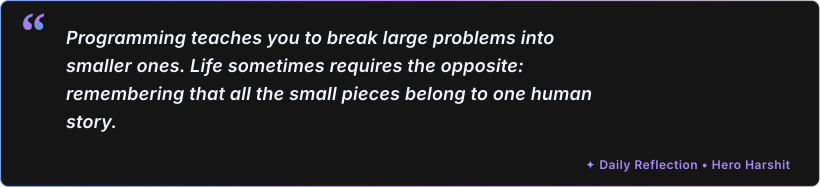
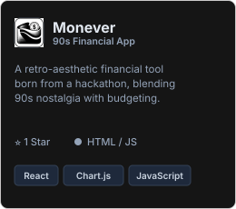
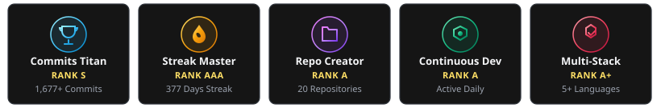

  

 

# 1. About Me

I’m $\color{#ffb74d}{\textbf{Hero Harshit}}$, a second-year IT student at the $\color{#ffb74d}{\textbf{International Institute of Information Technology, Pune}}$, an author, a poet, and someone who enjoys wandering through the strange intersection of technology and human expression.

I’m currently exploring $\color{#ffb74d}{\textbf{Large Language Models}}$, $\color{#ffb74d}{\textbf{Agentic AI}}$, and $\color{#ffb74d}{\textbf{Intelligent Systems}}$, while already skilled in HTML, CSS, JavaScript, Python, SQL, Node.js, React, Git, and GitHub. I enjoy creating websites and applications that do more than simply solve a problem. I like giving them a personality, an idea, a story, or a little bit of depth that makes the experience feel distinctly human. Didn't understand what I mean ? Just look at my projects section, you will understand.

I’m not chasing a particular title or rushing toward a destination right now. I’m simply learning, experimenting, breaking things, rebuilding them, and trying to understand what computers can become when we stop treating them as machines that only calculate and start treating them as $\color{#ffb74d}{\textbf{tools for expression}}$.

<!-- DAILY_QUOTE:START -->

  

<!-- DAILY_QUOTE:END -->

### ※ My Signature Projects (Top 3)

  &nbsp;&nbsp;
  &nbsp;&nbsp;
  

---

# 2. My Socials

 [![LeetCode](https://img.shields.io/badge/LeetCode-151515?style=for-the-badge&logo=data%3Aimage%2Fsvg%2Bxml%3Bbase64%2CPHN2ZyB4bWxucz0iaHR0cDovL3d3dy53My5vcmcvMjAwMC9zdmciIHZpZXdCb3g9IjAgMCAyNCAyNCIgZmlsbD0iI0ZGQTExNiI%2BPHBhdGggZD0iTTEzLjQ4MyAwYTEuMzc0IDEuMzc0IDAgMCAwLS45NjEuNDM4TDcuMTE2IDYuMjI2bC0zLjg1NCA0LjEyNmE1LjI2NiA1LjI2NiAwIDAgMC0xLjIwOSAyLjEwNCA1LjM1IDUuMzUgMCAwIDAtLjEyNS41MTMgNS41MjcgNS41MjcgMCAwIDAgLjA2MiAyLjM2MiA1LjgzIDUuODMgMCAwIDAgLjM0OSAxLjAxNyA1LjkzOCA1LjkzOCAwIDAgMCAxLjI3MSAxLjgxOGw0LjI3NyA0LjE5My4wMzkuMDM4YzIuMjQ4IDIuMTY1IDUuODUyIDIuMTMzIDguMDYzLS4wNzRsMi4zOTYtMi4zOTJjLjU0LS41NC41NC0xLjQxNC4wMDMtMS45NTVhMS4zNzggMS4zNzggMCAwIDAtMS45NTEtLjAwM2wtMi4zOTYgMi4zOTJhMy4wMjEgMy4wMjEgMCAwIDEtNC4yMDUuMDM4bC0uMDItLjAxOS00LjI3Ni00LjE5M2MtLjY1Mi0uNjQtLjk3Mi0xLjQ2OS0uOTQ4LTIuMjYzYTIuNjggMi42OCAwIDAgMSAuMDY2LS41MjMgMi41NDUgMi41NDUgMCAwIDEgLjYxOS0xLjE2NEw5LjEzIDguMTE0YzEuMDU4LTEuMTM0IDMuMjA0LTEuMjcgNC40My0uMjc4bDMuNTAxIDIuODMxYy41OTMuNDggMS40NjEuMzg3IDEuOTQtLjIwN2ExLjM4NCAxLjM4NCAwIDAgMC0uMjA3LTEuOTQzbC0zLjUtMi44MzFjLS44LS42NDctMS43NjYtMS4wNDUtMi43NzQtMS4yMDJsMi4wMTUtMi4xNThBMS4zODQgMS4zODQgMCAwIDAgMTMuNDgzIDB6bS0yLjg2NiAxMi44MTVhMS4zOCAxLjM4IDAgMCAwLTEuMzggMS4zODIgMS4zOCAxLjM4IDAgMCAwIDEuMzggMS4zODJIMjAuNzlhMS4zOCAxLjM4IDAgMCAwIDEuMzgtMS4zODIgMS4zOCAxLjM4IDAgMCAwLTEuMzgtMS4zODJ6Ii8%2BPC9zdmc%2B)](https://leetcode.com/u/HeroHarshit/) 

 

# 3. Tech Stack

                              

 

# 4. Achievements & Trophies

  <picture>
    <source media="(prefers-color-scheme: light)" srcset="./trophies-light.svg">
    <source media="(prefers-color-scheme: dark)" srcset="./trophies-dark.svg">
    
  </picture>

 

# 5. GitHub Stats

  <picture>
    <source media="(prefers-color-scheme: light)" srcset="./github-stats-light.svg">
    <source media="(prefers-color-scheme: dark)" srcset="./github-stats-dark.svg">
    
  </picture>
  <picture>
    <source media="(prefers-color-scheme: light)" srcset="./streak-stats-light.svg">
    <source media="(prefers-color-scheme: dark)" srcset="./streak-stats-dark.svg">
    
  </picture>
  <picture>
    <source media="(prefers-color-scheme: light)" srcset="./top-langs-light.svg">
    <source media="(prefers-color-scheme: dark)" srcset="./top-langs-dark.svg">
    
  </picture>
  <picture>
    <source media="(prefers-color-scheme: light)" srcset="./productivity-light.svg">
    <source media="(prefers-color-scheme: dark)" srcset="./productivity-dark.svg">
    
  </picture>

# 6. 3D Contribution Landscape

  <picture>
    <source media="(prefers-color-scheme: light)" srcset="./profile-3d-contrib/profile-green-animate.svg">
    <source media="(prefers-color-scheme: dark)" srcset="./profile-3d-contrib/profile-night-view.svg">
    
  </picture>

 

# 7. Latest GitHub Activity

<!--START_SECTION:activity-->
*Generating latest GitHub Activity Feed... Please commit and push to GitHub to run the Action!*
<!--END_SECTION:activity-->
